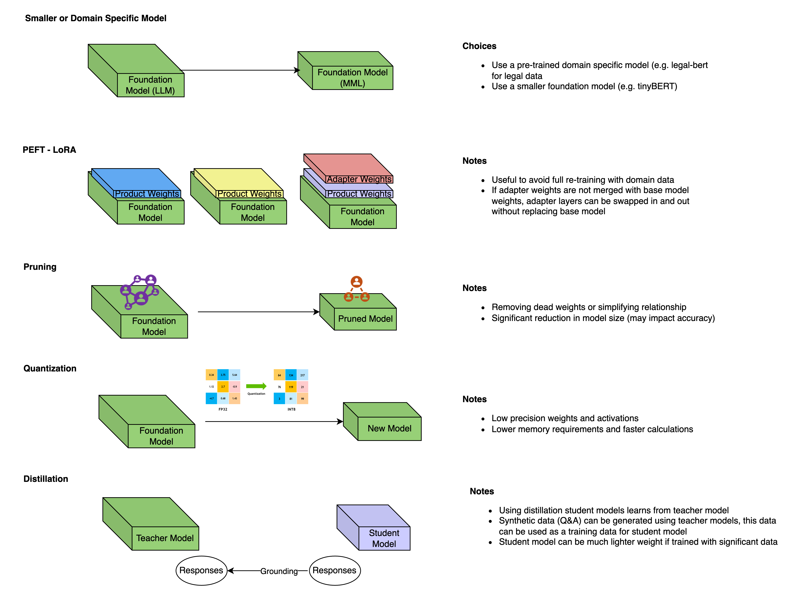
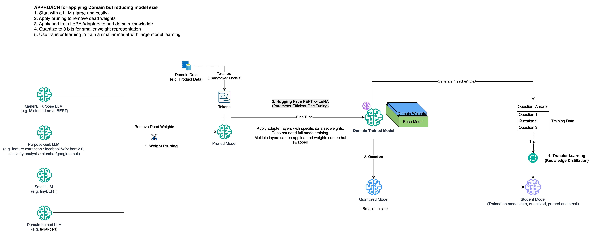

# Fine Tune General Purpose LLM to Domain Specific Model

## Problem Statement
Large Language Models (LLMs) are typically trained on massive datasets, resulting in models that are both large in size and often lacking the domain-specific accuracy needed for tasks like search and retrieval.

To effectively use these models within a specific domain, it's essential to reduce their size—optimizing for both storage and runtime efficiency—and fine-tune them using relevant domain data.

In this project, we’ll explore various solution approaches, discuss their pros and cons, and demonstrate one of them with a practical example.

## Solution Approaches
- Start with a LLM ( large and costly)
- Apply pruning to remove dead weights
- Apply and train LoRA Adapters to add domain knowledge
- Quantize to 8 bits for smaller weight representation
- Use transfer learning to train a smaller model with large model learning

https://github.com/souravt/design/blob/main/Building%20Domain%20Specific%20Small%20Model.drawio
### Optimization Techniques


### Optimization Flow


## Use case

Lets assume we have a product catalog and it needs to support user queries like the following : 
```Which type of water meter is best suited for residential apartment complexes in Bengaluru?```

## Sample Implementation
### Training data
Generated symthetic data : [industrial_iot_skus.jsonl](data/industrial_iot_skus.jsonl)
## How to Run?
Run [productapi.py](productapi.py)
### Using cURL
```aiignore
curl --location 'http://localhost:8000/search' \
--header 'Content-Type: application/json' \
--data '{"query": "Which type of water meter is best suited for residential apartment complexes in Bengaluru?"}'

```

#### Expected Response
```aiignore
{
    "products": [
        {
            "sku": "FLOWIQ-80DN-00735",
            "product_name": "flowIQ® 80DN",
            "manufacturer": "Honeywell",
            "category": "Water Meter",
            "application": "Residential",
            "features": [
                "Tamper alarms",
                "Leak detection",
                "No moving parts"
            ],
            "specifications": {
                "pipe_diameter": "80 mm",
                "ip_rating": "IP68",
                "measurement_principle": "Thermal",
                "power_source": "Solar",
                "temperature_range": "-10°C to 65°C"
            },
            "status": "Available"
        },
        {
            "sku": "FLOWIQ-32DN-00013",
            "product_name": "flowIQ® 32DN",
            "manufacturer": "Kamstrup",
            "category": "Water Meter",
            "application": "Residential",
            "features": [
                "Remote monitoring",
                "Real-time data logging",
                "Leak detection",
                "Wireless communication",
                "Tamper alarms"
            ],
            "specifications": {
                "pipe_diameter": "32 mm",
                "ip_rating": "IP68",
                "measurement_principle": "Ultrasonic",
                "power_source": "Solar",
                "temperature_range": "-16°C to 70°C"
            },
            "status": "Available"
        },
        {
            "sku": "FLOWIQ-65DN-00744",
            "product_name": "flowIQ® 65DN",
            "manufacturer": "Honeywell",
            "category": "Water Meter",
            "application": "Residential",
            "features": [
                "Tamper alarms",
                "IP68 rating",
                "Leak detection"
            ],
            "specifications": {
                "pipe_diameter": "65 mm",
                "ip_rating": "IP68",
                "measurement_principle": "Thermal",
                "power_source": "Solar",
                "temperature_range": "-3°C to 62°C"
            },
            "status": "Available"
        }
    ],
    "explanations": [
        "flowIQ® 80DN by Honeywell is recommended because it is a Water Meter designed for Residential applications. It is suitable for Bengaluru's climate with features like Features: Tamper alarms, Leak detection, No moving parts. Specifications: {'pipe_diameter': '80 mm', 'ip_rating': 'IP68', 'measurement_principle': 'Thermal', 'power_source': 'Solar', 'temperature_range': '-10°C to 65°C'}. Status: Available.",
        "flowIQ® 32DN by Kamstrup is recommended because it is a Water Meter designed for Residential applications. It is suitable for Bengaluru's climate with features like Features: Remote monitoring, Real-time data logging, Leak detection, Wireless communication, Tamper alarms. Specifications: {'pipe_diameter': '32 mm', 'ip_rating': 'IP68', 'measurement_principle': 'Ultrasonic', 'power_source': 'Solar', 'temperature_range': '-16°C to 70°C'}. Status: Available.",
        "flowIQ® 65DN by Honeywell is recommended because it is a Water Meter designed for Residential applications. It is suitable for Bengaluru's climate with features like Features: Tamper alarms, IP68 rating, Leak detection. Specifications: {'pipe_diameter': '65 mm', 'ip_rating': 'IP68', 'measurement_principle': 'Thermal', 'power_source': 'Solar', 'temperature_range': '-3°C to 62°C'}. Status: Available."
    ]
}
```